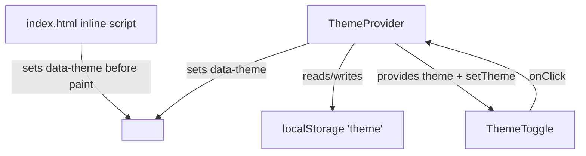

# Design — Dark Mode Toggle

> Example spec. Delete the `example-feature/` folder once your team has seen it.

## Architecture overview

A small `ThemeProvider` owns theme state and exposes it via context. A
`ThemeToggle` component flips it. A blocking inline script applies the stored/OS
theme before first paint to avoid a flash of the wrong theme (FOUC).

## Components

| Component | Responsibility | Satisfies |
|---|---|---|
| Inline pre-paint script | Read localStorage or `prefers-color-scheme`, set `data-theme` on `<html>` before render | R3, R4 |
| `ThemeProvider` | Hold current theme, persist on change, expose context | R1, R2, R5 |
| `ThemeToggle` | Button that calls `setTheme(next)` | R1 |
| `useTheme()` hook | Read context in any component | R1 |

## Data model

- `theme: 'light' | 'dark'`
- Persisted as a single localStorage key `theme`.

## Error handling

- localStorage access wrapped in try/catch; on failure, fall back to OS
  preference and operate in-memory only (R5).

## File structure plan

- `src/theme/ThemeProvider.tsx` — provider + context (new)
- `src/theme/ThemeToggle.tsx` — toggle button (new)
- `src/theme/useTheme.ts` — hook (new)
- `index.html` — add inline pre-paint script (edit)
- `src/styles/theme.css` — `[data-theme="dark"]` variables (new/edit)
